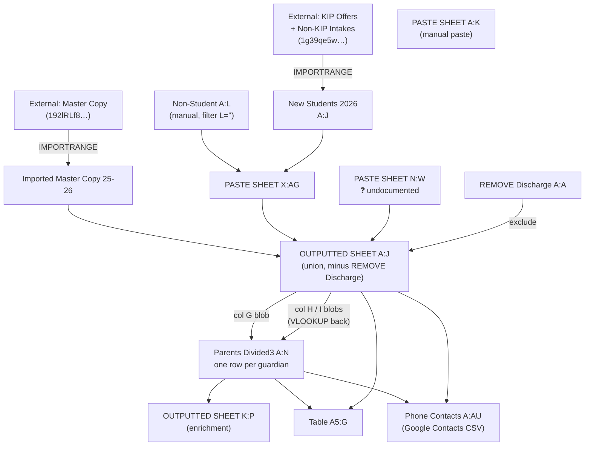

# Discharged-KIP — Spreadsheet Architecture

Living document. Captures the current formula-based design, known defects, and the
migration plan toward Apps Script. Updated as each sheet is walked through.

**Status:** intake in progress. Sheets documented so far: `PASTE SHEET`, `Non-Student`,
`New Students 2026`, `OUTPUTTED SHEET`, `Parents Divided3`, `Table`, `Phone Contacts`,
`Imported Master Copy 25-26`.

---

## 1. Data flow



The important structural fact: **`OUTPUTTED SHEET` and `Parents Divided3` are mutually
dependent.** `Parents Divided3` reads `OUTPUTTED SHEET` columns D, G, H, I; `OUTPUTTED
SHEET` K:P read back from `Parents Divided3`. It is not a true circular reference
(different columns), but it means any edit anywhere forces a full recalculation of both
sheets and everything downstream.

---

## 2. Sheet inventory

### `PASTE SHEET`

| Range | Purpose |
| --- | --- |
| `A:K` | Manual paste. Headers: OSIS, Last Name, First Name, OSIS, Site, Class/Teacher, Parent Name, Email Address, Parent Cell, Label, In our Out |
| `N:W` | **Undocumented.** Consumed by `OUTPUTTED SHEET` as a third union input (10 cols) |
| `X:AG` | Formula. Stacks `Non-Student` (where L is blank) + `New Students 2026` |

`X2` wraps both `FILTER`s in `IFERROR` with a blank-row fallback, then strips blank rows
with an outer `FILTER`. Mechanically correct, but see [F-07](#f-07).

### `Non-Student`

`A:L`. Columns A:J feed the union; K (`Column 12`) and L (`KIP Keep Remove`) are control
metadata. Rows are included when `TRIM(L) = ""`.

### `New Students 2026`

`A:J`, single `LET` in `A2`. Two `IMPORTRANGE` pulls (`KIP Offers!A2:AH`,
`'Non-KIP Intakes'!A2:AH`) reshaped to a common 10-column layout and stacked.

Note the two tables use **different source column offsets** for the same three output
fields — `32, 33, 34` for KIP Offers vs `30, 31, 32` for Non-KIP Intakes. See [F-06](#f-06).

### `OUTPUTTED SHEET`

`A:P`. The master roster.

- `A2` — `ARRAYFORMULA(FILTER(...))` union of `Imported Master Copy 25-26!A3:J`,
  `PASTE SHEET!X2:AG`, `PASTE SHEET!N2:W`, excluding OSIS values present in
  `REMOVE Discharge!A2:A`.
- `K` — all guardian names, `" and "`-joined
- `L` — all guardian emails, newline-joined, deduped
- `M` — all guardian phones, newline-joined, deduped
- `N` — sibling detection, by matching on the *text* of column K
- `O` — "Mom name 2": guardian names with relationship, restricted to `DNA = "no"`
- `P` — `C2 & " " & B2` (First Last)

K through P are **per-row dragged formulas**, not array formulas.

### `Parents Divided3`

`A:N`. Explodes one student row into one row per guardian.

- `A2` — splits `OUTPUTTED SHEET!G` (Parent Name blob) on newline using `♦`/`♣`
  sentinels, emits `student_id` + `Guardian output` pairs
- `C:G` — regex field extraction from the guardian string (first name, last name,
  relationship, language, DNA flag)
- `H:J` — emails, via `VLOOKUP` back into `OUTPUTTED SHEET!H` + dynamic regex
- `K:N` — phones, via `VLOOKUP` back into `OUTPUTTED SHEET!I` + dynamic regex

H through N are the performance and correctness hot spot. See [F-01](#f-01),
[F-02](#f-02), [F-03](#f-03).

### `Table`

Display/report layer. Header at row 4, data from row 5.

- `A5` — `LET` + `BYROW` over `INDIRECT(B1 & "!B2:P")`, reshaping to
  OSIS / Student / Guardian / Site / Class / Label
- `G5` — `MAP` over `A5:A600` building a delimited guardian sub-table per student
  (Name, Relationship, Language, Email, Phone, Primary), joined with `《§ROW§》` /
  `《§COL§》` sentinels

### `Phone Contacts`

`A:AU`, Google Contacts CSV import layout. Every populated column is a **single-cell
formula dragged down**, positionally aligned 1:1 with `Parents Divided3` rows.

### `Imported Master Copy 25-26`

`A2` — `IMPORTRANGE(…, "'Master Copy'!C1:C")`. Single column. See [F-08](#f-08).

---

## 3. Findings

Ordered by severity. `F-01`–`F-05` are correctness; `F-06`–`F-09` are robustness;
`F-10`–`F-12` are performance.

### F-01 — Guardian blocks bleed into each other (silent wrong data)

`Parents Divided3` H, I, J, K, M all collapse the blob with
`SUBSTITUTE(…, CHAR(10), " ")` and then match:

```
Guardian\s*\d+\s*-\s*<First>\s+<Last>.*?Contact\s*1:\s*(…)
```

Collapsing newlines destroys the guardian boundaries, and `.*?` is free to run past the
end of the matched guardian's block. If Guardian 1 has no `Contact 1:`, the lazy match
continues into Guardian 2's text and returns **Guardian 2's email/phone attributed to
Guardian 1**. No error is raised.

`L2` already solves this — it rewrites `Guardian` to `♦` and constrains the gap with
`[^♦]*?`. `N2` solves it differently, by keeping newlines and anchoring with
`(?:^|[\r\n])` / `[^\r\n]*`.

So there are **three different strategies across seven columns**, and five of them are
wrong. Fix: apply the `♦` sentinel approach (or the line-anchored approach) uniformly.

### F-02 — Regex escaping of guardian names is a no-op

Used in H through N:

```
REGEXREPLACE(C2:C, "([.^$*+?()\\[\\]{}\\|\\\\])", "\\$1")
```

Google Sheets string literals do **not** process backslash escapes, so the pattern
reaches RE2 verbatim. The character class terminates early at the first unescaped `]`,
and the remainder (`{}\|\\])`) is parsed as literal text plus an alternation. The
expression therefore matches essentially nothing, and names pass through unescaped.

Consequences for a name containing a regex metacharacter:

| Name contains | Result |
| --- | --- |
| `.` (e.g. `Jr.`) | `.` matches any character — usually harmless, occasionally a false match |
| `(` or `)` | Unbalanced group → `REGEXEXTRACT` errors → swallowed by `IFERROR` → **silent blank** |
| `+`, `*`, `?` | Invalid or wrong quantifier → same silent blank |

The replacement string `"\\$1"` is also wrong independently: it emits two literal
backslashes before the group, so even if the match succeeded the output would be
`\\.` — "literal backslash, then any character."

### F-03 — Duplicate phone numbers when `Contact 1:` is absent

`K2` (mobile) matches `Contact 1:` and **falls back to `Contact 2:`**. `L2`
(secondary_phone) matches `Contact 2:`. A guardian with only a `Contact 2:` therefore
gets the same number in both K and L.

`OUTPUTTED SHEET!M` survives this because it wraps in `UNIQUE`. Not deduped:

- `Table!G5` — `TEXTJOIN(CHAR(10), TRUE, FILTER(r, r<>""))` over K:N
- `Phone Contacts` — `S` (Phone 1) and `U` (Phone 2) both populate

### F-04 — Sibling label likely shows OSIS instead of last name

`OUTPUTTED SHEET!N2`:

```
FILTER(D:D & " " & C:C & " (" & A:A & ")", …)
```

With the stated header layout (A = OSIS, B = Last Name, C = First Name, D = OSIS), this
renders `"<OSIS> <First> (<OSIS>)"` — OSIS twice, no last name. Presumably intended
`C:C & " " & B:B` → `"<First> <Last> (<OSIS>)"`.

### F-05 — Sibling matching is string equality on a joined name list

`N2` groups siblings with `COUNTIF(K:K, K2) > 1`, where K is the `" and "`-joined
guardian names. This misses siblings whenever the two students' guardian lists differ in
**order, spelling, whitespace, or membership** (one child has a stepparent listed, the
other doesn't). Two additional hazards:

- `COUNTIF` treats `?` and `*` in the criterion as wildcards.
- `COUNTIF` criteria longer than 255 characters fail. A student with three guardians can
  exceed that.

A normalized household key (sorted set of guardian emails/phones) is far more reliable.

### F-06 — Hard-coded external column indices

`New Students 2026` reaches into source columns `7, 10, 32, 33, 34` (KIP Offers) and
`7, 10, 30, 31, 32` (Non-KIP Intakes) by position. Inserting or reordering a column in
either external sheet silently shifts the data — no error, just wrong values in the
roster. Matching on header text would fail loudly instead.

### F-07 — `IFERROR` masks IMPORTRANGE failures

`PASTE SHEET!X2` wraps each `FILTER` in `IFERROR(…, {"","",…})`. This catches genuine
failures too — revoked IMPORTRANGE authorization, a renamed source tab, a timeout — and
converts them into "zero new students," which then flows into `OUTPUTTED SHEET` as a
silently shorter roster. Same pattern throughout `Parents Divided3` H:N.

### F-08 — `Imported Master Copy 25-26` imports one column, ten are read

`A2` imports `'Master Copy'!C1:C` — a single column. `OUTPUTTED SHEET!A2` reads
`'Imported Master Copy 25-26'!A3:J` — ten. Either B:J are populated by formulas not yet
documented, or the union is padding nine empty columns. **Open question.**

### F-09 — `Table!A5` reads `B1`, notes say the sheet name lives in `B2`

`INDIRECT(B1 & "!B2:P")` vs the stated `B2 = "Outputted Sheet"`. One of the two is a
typo. Also worth noting: `INDIRECT` is volatile and recalculates on every change to the
workbook.

### F-10 — `Parents Divided3` H:N is O(students × guardians)

Each of the seven columns performs, per row, a full-column unsorted `VLOOKUP` into
`OUTPUTTED SHEET` followed by construction and evaluation of a dynamic regex.

At ~1,200 students / ~2,400 guardian rows: 7 × 2,400 ≈ 16,800 regex compilations, each
preceded by a linear scan of ~1,200 rows ≈ **20M cell comparisons per recalc.**

### F-11 — `OUTPUTTED SHEET` K, L, M, N, O are per-row `FILTER`s

Four columns × ~1,200 rows, each scanning all ~2,400 guardian rows ≈ **11M comparisons.**
`N` additionally runs a full-column `COUNTIF` per row.

### F-12 — `Table!G5` runs six `FILTER`s per student, capped at row 600

`MAP` over `A5:A600` × 6 `FILTER`s over `Parents Divided3` ≈ **8.6M comparisons**, and the
hard-coded `600` bound silently truncates the report past ~596 students.

Additional smaller items:

- `OUTPUTTED SHEET!A2` rebuilds the same three-way `VSTACK` **three times** (data, `LEN`
  condition, `COUNTIF` condition). A `LET` binding would compute it once.
- `Phone Contacts` uses positionally-aligned dragged formulas against a spilled array. If
  `Parents Divided3` changes row count, every row below the change is misaligned — and
  because A, C, E, L… all reference the same row index, the misalignment is *consistent*,
  so it produces plausible-looking but wrong contact records.
- `Phone Contacts!E2` and `AU2` use `VLOOKUP` without `IFERROR` → visible `#N/A`.
- Columns A and D are duplicate OSIS values throughout. Harmless, but doubles the width of
  every union.

---

## 4. Recommendation: hybrid, not all-formula and not all-script

**Keep as formulas** — cheap, and they benefit from staying live:

- `Imported Master Copy 25-26`
- `New Students 2026`
- `PASTE SHEET!X:AG`
- `OUTPUTTED SHEET!A:J` (the union itself)

**Move to Apps Script**, writing static values on a menu action and/or a time trigger:

- `Parents Divided3` (whole sheet)
- `OUTPUTTED SHEET!K:P`
- `Table!A5` and `Table!G5`
- `Phone Contacts`

### Why script specifically wins for the parsing layer

1. **One parse pass instead of seven.** Split each blob on `/Guardian\s*\d+\s*-/` once,
   per student, and read every field out of the resulting block. Replaces ~16,800 regex
   evaluations with ~1,200 splits.
2. **F-01 stops being possible.** Guardian boundaries become a structural property of the
   split, not something each of seven regexes has to re-derive correctly.
3. **Failures become visible.** A script can log "37 students had unparseable guardian
   blocks" rather than `IFERROR`-ing them to blank (F-07).
4. **Static values load instantly.** No recalc storm, no IMPORTRANGE timeout cascading
   through five dependent sheets.
5. **`Phone Contacts` becomes a real export.** Generate the CSV directly instead of
   maintaining ~20 dragged columns that depend on row alignment holding.
6. **Sibling detection gets a real key** (F-05) — normalize and sort guardian contact
   identifiers, hash, group. Not expressible cleanly in a formula.

### What stays risky either way

The upstream format is prose. `Guardian 1 - Jane Doe (Mother - Spanish) Contact 1: …` is
human-entered, and no parser survives arbitrary drift. The script should therefore
**report** unparsed rows rather than silently dropping them — that visibility is most of
the value of the migration.

---

## 5. Open questions

1. **`PASTE SHEET!N:W`** — what feeds it, and what are its columns? It is a third of the
   `OUTPUTTED SHEET` union and currently undocumented.
2. **`Imported Master Copy 25-26`** — where do B:J come from, given `A2` imports only
   `'Master Copy'!C1:C`? (F-08)
3. **`Table`** — is the source sheet name in `B1` or `B2`? (F-09)
4. **Blob samples.** Two or three real (anonymized) values of `OUTPUTTED SHEET` G, H, and
   I for a student with 2+ guardians. This is the single highest-value input for the
   parser. Specifically: is `Contact N:` numbered per-guardian or globally, and does every
   guardian block reliably start on its own line?
5. **DNA semantics.** `Parents Divided3!G` sets `"No"` when the string starts with `*`.
   `OUTPUTTED SHEET!O` then keeps rows where `DNA = "no"`, and `Table!G5` inverts again to
   produce "Primary". Confirm the intended meaning end-to-end — it currently reads as a
   triple negative.
6. **Volume.** Roughly how many students and guardians? Determines how aggressive the
   migration needs to be.
7. **`REMOVE Discharge`** — is it just a list of OSIS values in column A?
8. **Manual edits.** Does anyone type into `OUTPUTTED SHEET` K:P, `Table`, or
   `Phone Contacts` by hand? Static writes would overwrite them, which changes the design.

---

## 6. Changelog

| Date | Change |
| --- | --- |
| 2026-07-30 | Initial architecture capture from formula walkthrough; findings F-01–F-12 |
